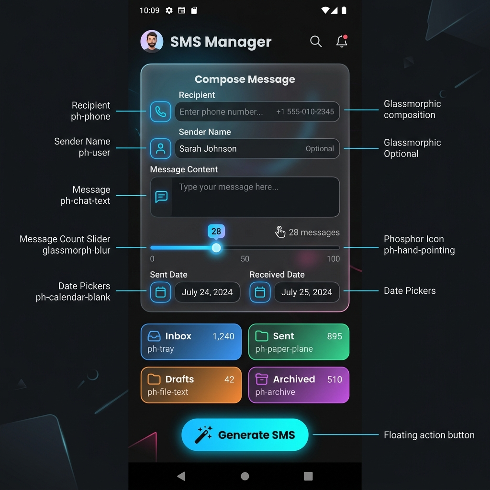

# 📱 SMS Manager

Welcome to **SMS Manager**! A sleek, modern, and powerful testing tool that allows you to safely generate mock SMS messages and place them directly into your device's native messaging app.

---

## 📸 Sneak Peek

Here is how the beautiful, glassmorphic dark-mode UI looks in action:

---

## ✨ Features & Functions

- **📥 Direct Inbox Insertion**: Generate messages that appear directly in your default messaging app. No root required!
- **🗂️ Destination Folders**: Choose exactly where your message goes—Inbox, Sent, Draft, Failed, or Queued.
- **🕒 Custom Timing**: Manipulate the 'Sent' and 'Received' timestamps of your messages down to the exact minute.
- **📇 Contact Picker**: Seamlessly select existing contacts from your phonebook to use as the sender/recipient.
- **🪄 Bulk Generation**: A built-in slider allows you to generate up to 100 messages at once!
- **🎨 Stunning UI**: Built with a gorgeous 2026 glassmorphism dark theme, featuring fluid animations and beautiful Phosphor icons.

---

## 🔐 Permissions Required

To function fully and offline, SMS Manager requests the following device permissions:

1. **SMS Permissions** (`READ_SMS`, `SEND_SMS`, `RECEIVE_SMS`, `BROADCAST_SMS`) 💬
   - *Why?* We need this to become the temporary Default SMS App, which is an Android security requirement to write directly to your SMS database. We never transmit your messages anywhere.
2. **Contact Permissions** (`READ_CONTACTS`, `WRITE_CONTACTS`) 👥
   - *Why?* To let you easily pick phone numbers and names from your address book instead of typing them manually.

> **Note**: This app is 100% offline. What happens on your device stays on your device. 🛡️

---

## 🚀 Download & Installation

Ready to try it out? You can download the latest pre-compiled Android APK directly from our releases!

⬇️ [**Download the Latest APK Release Here**](https://github.com/thejulan/fake-sms/releases/latest)

*(Once downloaded, tap the APK to install. You may need to enable "Install from Unknown Sources" in your Android settings.)*

---

### 🛠️ Built With
- [Flutter](https://flutter.dev/) - UI Toolkit
- [Kotlin](https://kotlinlang.org/) - Native Android Integrations
